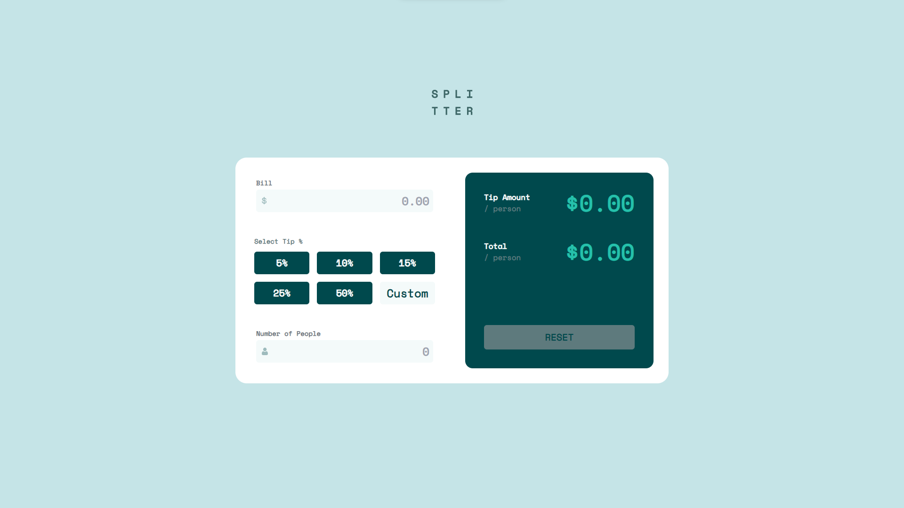
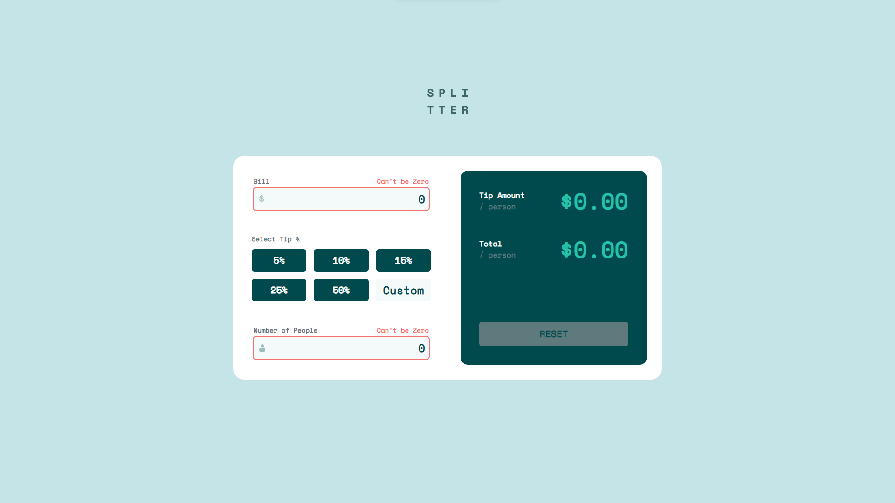
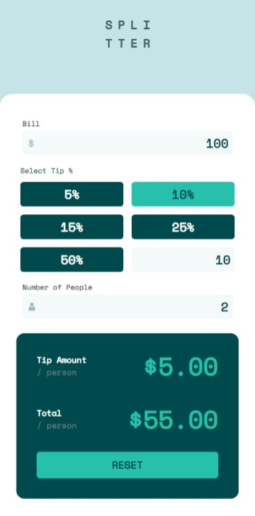

# Frontend Mentor - Tip calculator app solution

This is a solution to the [Tip calculator app challenge on Frontend Mentor](https://www.frontendmentor.io/challenges/tip-calculator-app-ugJNGbJUX). Frontend Mentor challenges help you improve your coding skills by building realistic projects.

## Table of contents

- [Overview](#overview)
  - [The challenge](#the-challenge)
  - [Screenshot](#screenshot)
  - [Links](#links)
- [My process](#my-process)
  - [Built with](#built-with)
- [Author](#author)

## Overview

### The challenge

Users should be able to:

- View the optimal layout for the app depending on their device's screen size
- See hover states for all interactive elements on the page
- Calculate the correct tip and total cost of the bill per person

### Screenshots

### Links

- Solution URL: [GitHub](https://github.com/Marwan-Ezzat-Mohamed/TipCalculator)
- Live Site URL: [Vercel](https://tip-calculator-alpha-ochre.vercel.app/)

## My process

### Built with

- Desktop-first workflow
- [Vite](https://vitejs.dev/) - JS bundler
- [pnpm](https://pnpm.js.org/) - Package manager
- [React](https://reactjs.org/) - JS library
- [TypeScript](https://www.typescriptlang.org/) - For type checking
- [TailwindCss](https://tailwindcss.com/) - For styles

## Author

- Frontend Mentor - [@Marwan-Ezzat-Mohamed](https://www.frontendmentor.io/profile/Marwan-Ezzat-Mohamed)
- Linkedin - [@marwan-ezzat-mohamed](https://www.linkedin.com/in/marwan-ezzat-mohamed/)
